# คู่มือการใช้งานฐานข้อมูล HAp Dopant Database

**เอกสารประกอบผลผลิตโครงการ FF68 — ผลผลิตประเภทที่ 7.2 ฐานข้อมูล (Database)**

---

## 1. ข้อมูลทั่วไป

| รายการ | รายละเอียด |
|---|---|
| ชื่อฐานข้อมูล | HAp Dopant Database — ML Screening of Hydroxyapatite Dopants |
| ชื่อภาษาไทย | ฐานข้อมูลสารเจือในไฮดรอกซีอะพาไทต์จากการคัดกรองด้วยการเรียนรู้ของเครื่อง |
| ช่องทางการเข้าถึง (URL) | https://aofphy.github.io/-hap-dopant-database |
| หน่วยงานผู้พัฒนา | ห้องปฏิบัติการ AIMS (Artificial Intelligence & Modeling for Materials Science) |
| โครงการต้นสังกัด | [ระบุชื่อโครงการ FF68] |
| หัวหน้าโครงการ | [ระบุชื่อหัวหน้าโครงการ] |
| ประเภทการเข้าถึง | เปิดสาธารณะ (Open access) ไม่ต้องลงทะเบียนหรือเข้าสู่ระบบ |
| รูปแบบระบบ | เว็บแอปพลิเคชันแบบโต้ตอบ (Interactive web application) |
| อุปกรณ์ที่รองรับ | คอมพิวเตอร์ แท็บเล็ต และโทรศัพท์มือถือ (responsive) |
| เบราว์เซอร์ที่รองรับ | Chrome, Safari, Firefox, Edge (เวอร์ชันปัจจุบัน) |
| วันที่จัดทำคู่มือ | 28 กรกฎาคม 2569 |

## 2. วัตถุประสงค์และขอบเขตของฐานข้อมูล

ฐานข้อมูลนี้รวบรวมและเผยแพร่ผลการคัดกรองสารเจือประจุบวก (cationic dopants) ที่แทนที่ตำแหน่ง Ca²⁺
ในโครงสร้างไฮดรอกซีอะพาไทต์ (hydroxyapatite, HAp) ครอบคลุมธาตุที่ไม่มีกัมมันตภาพรังสีจำนวน **59 ธาตุ**
โดยใช้แบบจำลองการเรียนรู้ของเครื่องแบบ transfer learning และตรวจสอบความถูกต้องด้วยการคำนวณ
ทฤษฎีฟังก์ชันนัลความหนาแน่น (DFT)

ขอบเขตข้อมูลที่ให้บริการ

- ค่ามอดุลัสเชิงปริมาตร (bulk modulus, K) และเปอร์เซ็นต์การเปลี่ยนแปลงเทียบ HAp บริสุทธิ์ (ΔK%)
- ค่าช่องว่างแถบพลังงาน (band gap, E_g) และพลังงานการก่อตัว (formation energy)
- รัศมีไอออน ประจุ กลุ่มธาตุ และระดับความเป็นพิษ (toxicity) ของแต่ละสารเจือ
- ค่าดัชนีความเหมาะสมทางชีวการแพทย์ (Biomedical Figure of Merit, BFoM)
- ผลการทำนายสำหรับการเจือร่วม (co-doping) ในระบบสองสารเจือ

**ข้อจำกัด** ค่าที่แสดงเป็นค่าทำนายจากแบบจำลอง มิใช่ค่าที่วัดจากการทดลอง ผู้ใช้ควรตรวจสอบด้วย
การคำนวณ DFT หรือการทดลองก่อนนำไปใช้ออกแบบวัสดุจริง

## 3. กลุ่มผู้ใช้ฐานข้อมูลเป้าหมาย

| กลุ่มผู้ใช้ | ลักษณะการใช้ประโยชน์ |
|---|---|
| นักวิจัยด้านวัสดุชีวภาพและวัสดุศาสตร์ | คัดเลือกสารเจือที่เพิ่มสมบัติเชิงกลของ HAp ก่อนการสังเคราะห์จริง |
| นักวิจัยด้านการคำนวณ (DFT / ML) | ใช้เป็นค่าอ้างอิงเริ่มต้นและกรอบเปรียบเทียบผลการคำนวณ |
| อาจารย์และนิสิตนักศึกษาระดับบัณฑิตศึกษา | ใช้ประกอบการเรียนการสอนและงานวิจัยด้าน computational materials science |
| นักวิจัยและผู้พัฒนาด้านวัสดุทางทันตกรรมและกระดูกเทียม | ประเมินความเหมาะสมของสารเจือทั้งด้านสมบัติเชิงกลและความเป็นพิษ |
| ผู้สนใจทั่วไป | เข้าถึงผลงานวิจัยในรูปแบบที่เข้าใจง่ายผ่านตารางธาตุเชิงโต้ตอบ |

## 4. ช่องทางการเข้าถึงฐานข้อมูล

1. **เว็บไซต์หลัก** https://aofphy.github.io/-hap-dopant-database
2. **ซอร์สโค้ดและข้อมูลดิบ** https://github.com/aofphy/-hap-dopant-database
3. **สถิติการเข้าใช้งานแบบสาธารณะ** https://hap-dopant-db.goatcounter.com

การเข้าถึงไม่มีค่าใช้จ่าย ไม่ต้องสมัครสมาชิก และไม่มีการเก็บข้อมูลส่วนบุคคลของผู้เข้าชม

## 5. โครงสร้างข้อมูลและแหล่งที่มา

### 5.1 โครงสร้างข้อมูลรายธาตุ

| ฟิลด์ข้อมูล | ความหมาย | หน่วย |
|---|---|---|
| Rank | ลำดับตามค่ามอดุลัสเชิงปริมาตรจากมากไปน้อย | – |
| Element | สัญลักษณ์ธาตุพร้อมสถานะออกซิเดชัน เช่น Sr²⁺ | – |
| Group | กลุ่มธาตุ (Alkali, Alkaline Earth, 3d/4d/5d TM, Lanthanide, Post-TM) | – |
| K | มอดุลัสเชิงปริมาตรที่ทำนายได้ | GPa |
| ΔK | เปอร์เซ็นต์การเปลี่ยนแปลงเทียบ HAp บริสุทธิ์ (102.92 GPa) | % |
| Ionic Radius | รัศมีไอออน | Å |
| Charge | ประจุของไอออนสารเจือ | – |
| Toxicity | ระดับความเป็นพิษ (Low / Moderate / High) | – |

### 5.2 แหล่งข้อมูลและแบบจำลอง

- **ข้อมูลฝึกแบบจำลอง** ฐานข้อมูล AFLOW (1,181 สารประกอบ สำหรับ bulk modulus) และ MatBench
  (อย่างละ 10,000 รายการ สำหรับ band gap และ formation energy)
- **ตัวบ่งชี้ลักษณะ (features)** Matminer MAGPIE descriptors จำนวน 132 มิติ
- **อัลกอริทึม** Random Forest พร้อมการประเมินความไม่แน่นอนแบบ bootstrap (n = 100)
- **การตรวจสอบด้วย DFT** VASP (ฟังก์ชันนัล PBE) จำนวน 20 สารเจือตัวแทน ทั้งตำแหน่ง Ca1 (4f)
  และ Ca2 (6h) รวม 58 โครงสร้าง

## 6. วิธีการใช้งาน

### 6.1 หน้าแรกและแถบนำทาง

เมื่อเปิด URL ของฐานข้อมูล จะพบหน้าแรกซึ่งสรุปขอบเขตงานวิจัยและตัวเลขสำคัญ ได้แก่ จำนวนธาตุที่คัดกรอง (59)
ความแม่นยำของแบบจำลอง (R² = 0.954) จำนวนการตรวจสอบด้วย DFT (20) และจำนวนสมบัติที่ทำนาย (3)
แถบนำทางด้านบนใช้ข้ามไปยังแต่ละส่วนของฐานข้อมูล และมุมขวาบนแสดงจำนวนผู้เข้าชมสะสม

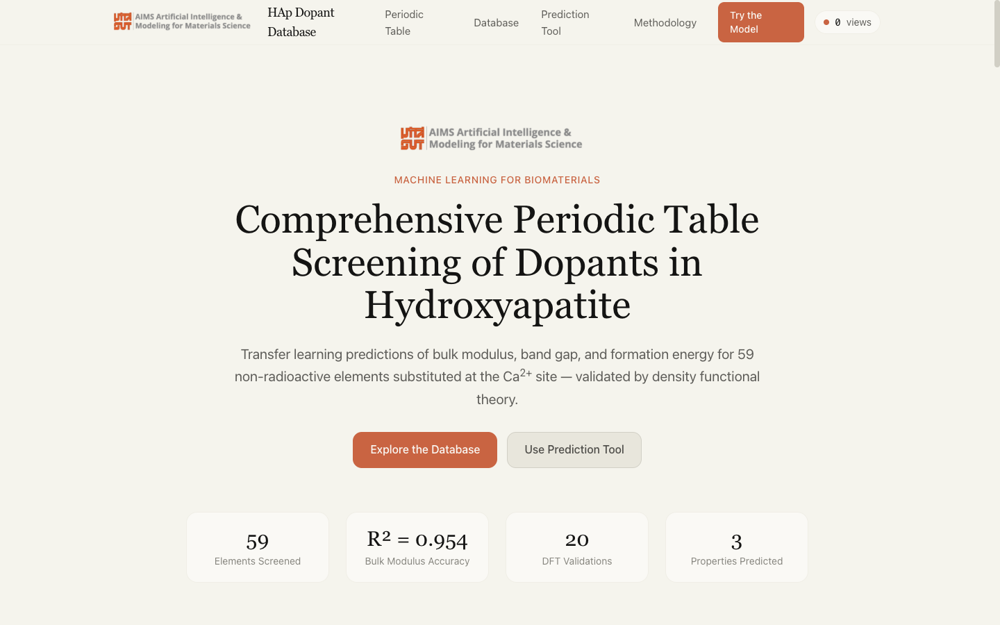

**รูปที่ 1** หน้าแรกของฐานข้อมูล แสดงแถบนำทาง ตัวนับผู้เข้าชม และตัวเลขสรุปผลการวิจัย

### 6.2 ตารางธาตุเชิงโต้ตอบ (Periodic Table Screening)

ส่วนนี้แสดงผลการคัดกรองในรูปแบบตารางธาตุ โดยใช้สีแทนการเปลี่ยนแปลงของมอดุลัสเชิงปริมาตร
สีแดง–ส้มหมายถึงสารเจือที่ทำให้โครงสร้างแข็งแรงขึ้น (strengthening) และสีน้ำเงินหมายถึงสารเจือที่ทำให้อ่อนลง
(weakening) ธาตุที่เป็นสีเทาคือธาตุที่ไม่อยู่ในขอบเขตการศึกษา

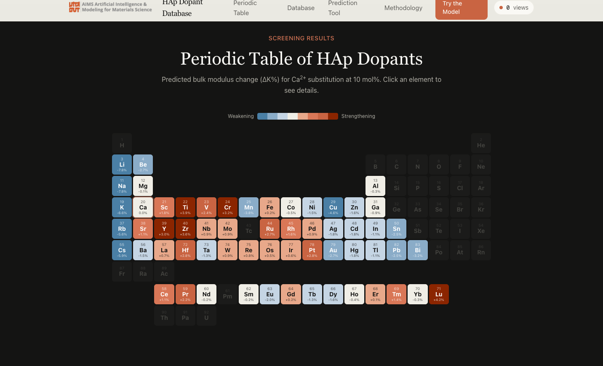

**รูปที่ 2** ตารางธาตุเชิงโต้ตอบพร้อมแถบสีมาตรฐาน (color scale)

**ขั้นตอนการใช้งาน**

1. เลื่อนหน้าจอมายังหัวข้อ *Periodic Table of HAp Dopants* หรือคลิกเมนู **Periodic Table**
2. สังเกตค่าที่แสดงใต้สัญลักษณ์ธาตุ ซึ่งเป็นค่า ΔK% ของธาตุนั้น
3. คลิกที่ธาตุที่สนใจ ระบบจะแสดงการ์ดรายละเอียดด้านล่างตาราง

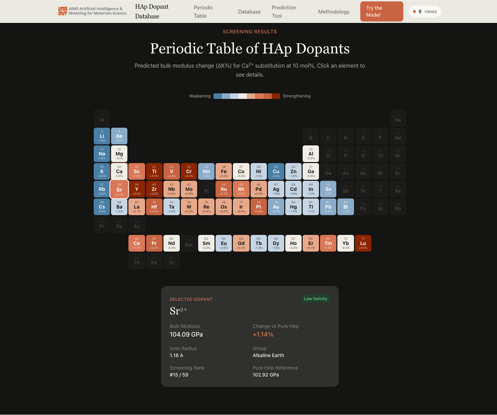

**รูปที่ 3** ตัวอย่างการคลิกเลือกธาตุ Sr²⁺ ระบบแสดงมอดุลัสเชิงปริมาตร 104.09 GPa (+1.14%)
รัศมีไอออน 1.18 Å กลุ่มธาตุ ลำดับการคัดกรอง (#15 จาก 59) และระดับความเป็นพิษ

### 6.3 ตารางฐานข้อมูลฉบับเต็ม (Dopant Screening Database)

ส่วนนี้แสดงข้อมูลครบทั้ง 59 ธาตุในรูปแบบตาราง พร้อมเครื่องมือค้นหา กรอง และเรียงลำดับ

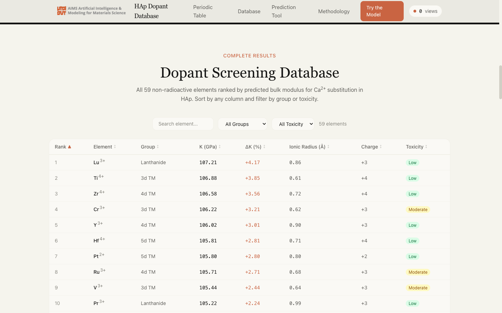

**รูปที่ 4** ตารางฐานข้อมูลแสดงผลเรียงตามลำดับการคัดกรอง

**ขั้นตอนการใช้งาน**

1. **ค้นหา** พิมพ์สัญลักษณ์ธาตุในช่อง *Search element…* เช่น `Sr` เพื่อกรองเฉพาะธาตุที่ต้องการ
2. **กรองตามกลุ่มธาตุ** เลือกจากรายการ *All Groups* เช่น Lanthanide, 3d TM
3. **กรองตามความเป็นพิษ** เลือกจากรายการ *All Toxicity* (Low / Moderate / High)
4. **เรียงลำดับ** คลิกที่หัวคอลัมน์ใดก็ได้เพื่อสลับการเรียงจากน้อยไปมากหรือมากไปน้อย
   สัญลักษณ์ ▲ / ▼ ระบุทิศทางการเรียงปัจจุบัน
5. ตัวเลขจำนวนรายการที่ผ่านเงื่อนไขจะแสดงถัดจากตัวกรอง (เช่น *14 elements*)

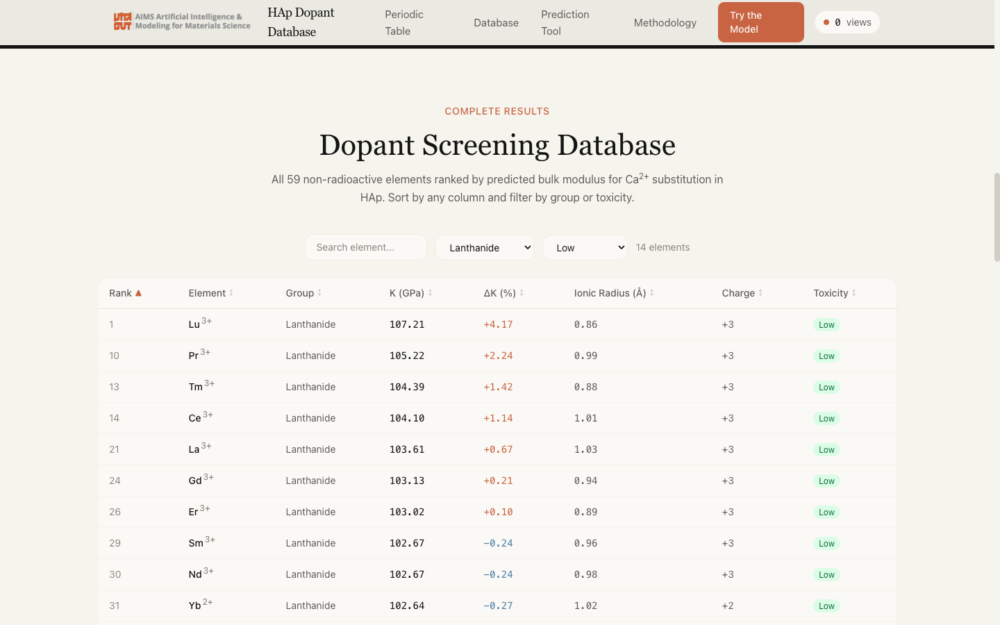

**รูปที่ 5** ตัวอย่างการกรองเฉพาะกลุ่มแลนทาไนด์ที่มีความเป็นพิษระดับต่ำ เหลือ 14 ธาตุ

### 6.4 เครื่องมือทำนายสมบัติ (Dopant Property Predictor)

เครื่องมือนี้ให้ผู้ใช้เลือกสารเจือและความเข้มข้นเพื่อดูค่าสมบัติที่ทำนายได้ แบ่งเป็น 3 โหมด

#### 6.4.1 โหมด Single Dopant — ทำนายสารเจือเดี่ยว

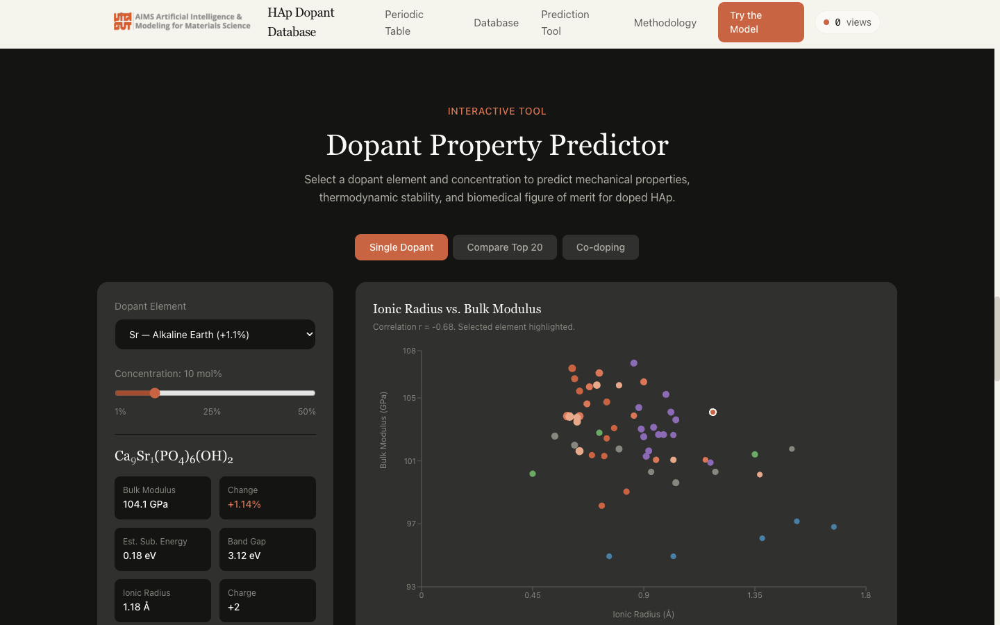

**รูปที่ 6** หน้าจอโหมด Single Dopant พร้อมแผนภาพความสัมพันธ์ระหว่างรัศมีไอออนกับมอดุลัสเชิงปริมาตร

**ขั้นตอนการใช้งาน**

1. เลือกธาตุจากรายการ *Dopant Element*
2. เลื่อนแถบ *Concentration* เพื่อกำหนดความเข้มข้นของการแทนที่ (1–50 mol%)
3. ระบบจะแสดงสูตรเคมีของสารประกอบที่ได้ เช่น Ca₉Sr₁(PO₄)₆(OH)₂ พร้อมค่าที่ทำนาย
4. อ่านค่าดัชนี BFoM ซึ่งรวมผลของสมบัติเชิงกล เสถียรภาพ โครงสร้างอิเล็กทรอนิกส์ และความเป็นพิษ
5. แผนภาพด้านขวาจะเน้นตำแหน่งของธาตุที่เลือกเทียบกับธาตุอื่นทั้งหมด

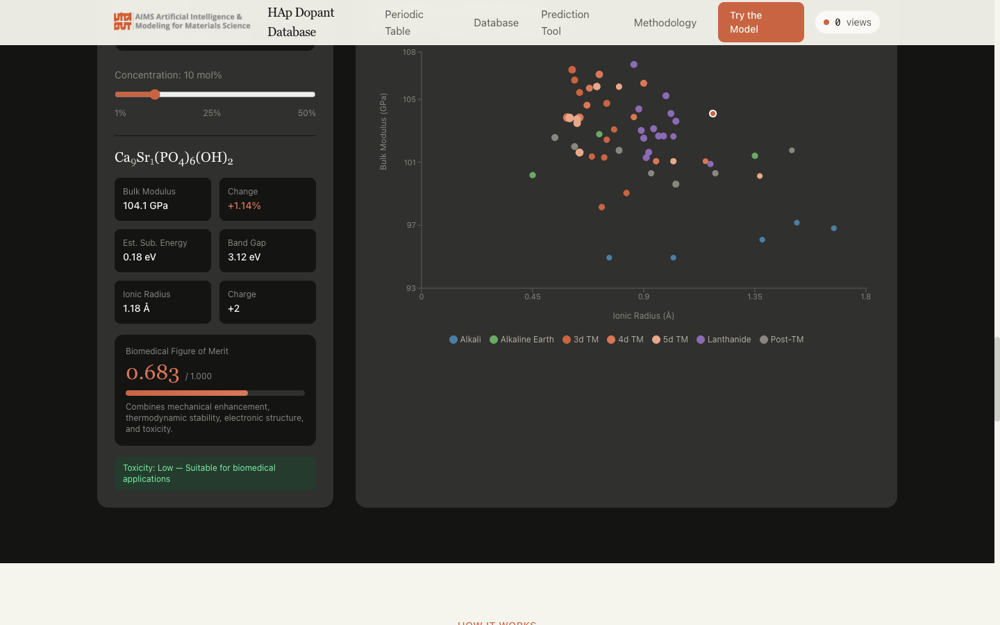

**รูปที่ 7** ผลการทำนายสำหรับ Ca₉Sr₁(PO₄)₆(OH)₂ ที่ 10 mol% ได้ K = 104.1 GPa (+1.14%)
band gap 3.12 eV และ BFoM = 0.683 พร้อมข้อความประเมินความเหมาะสมด้านความเป็นพิษ

#### 6.4.2 โหมด Compare Top 20 — เปรียบเทียบ 20 อันดับแรก

คลิกปุ่ม **Compare Top 20** เพื่อดูแผนภูมิแท่งเปรียบเทียบสารเจือ 20 อันดับแรกตามค่า ΔK%
เมื่อนำเมาส์ชี้ที่แท่งใด ระบบจะแสดงค่าของธาตุนั้น

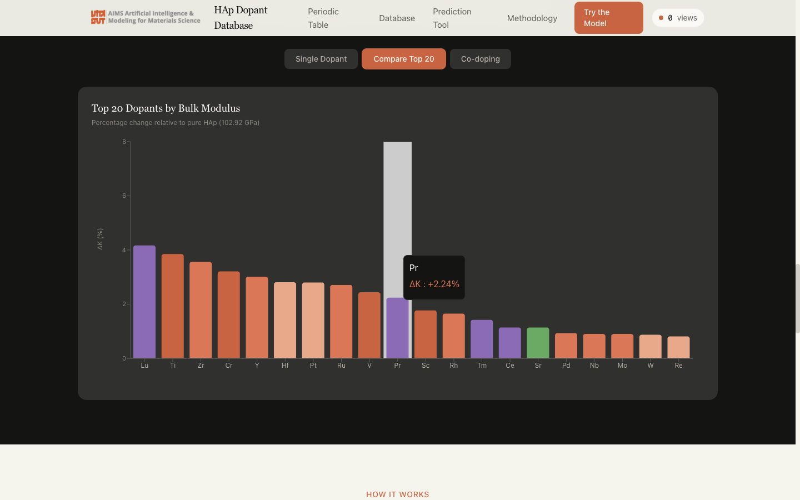

**รูปที่ 8** แผนภูมิเปรียบเทียบ 20 อันดับแรก โดยสีของแท่งแทนกลุ่มธาตุ

#### 6.4.3 โหมด Co-doping — การเจือร่วมสองธาตุ

คลิกปุ่ม **Co-doping** เพื่อดูผลการทำนายของระบบเจือร่วม Ca₈M₁N₁(PO₄)₆(OH)₂ พร้อมคำแนะนำ
เชิงออกแบบ ทั้งนี้ค่าที่แสดงคำนวณจากการประมาณแบบผสมเชิงเส้น (linear mixing approximation)
ซึ่งอาจไม่ครอบคลุมผลเสริมฤทธิ์หรือผลต้านฤทธิ์ระหว่างสารเจือ

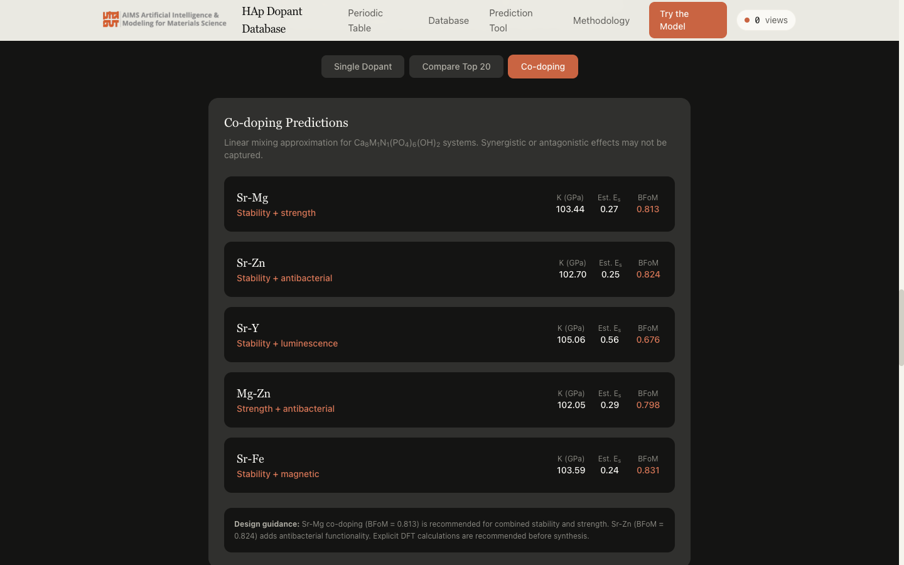

**รูปที่ 9** ตัวอย่างผลการเจือร่วม เช่น Sr–Mg (เสถียรภาพ + ความแข็งแรง, BFoM = 0.813)
และ Sr–Zn (เสถียรภาพ + ฤทธิ์ต้านแบคทีเรีย, BFoM = 0.824)

### 6.5 ส่วนระเบียบวิธีวิจัย (Methodology)

ส่วนนี้อธิบายที่มาของค่าที่แสดงในฐานข้อมูล เพื่อให้ผู้ใช้ประเมินความน่าเชื่อถือของข้อมูลได้ด้วยตนเอง
ประกอบด้วยขั้นตอนการพัฒนาแบบจำลอง 3 ขั้น ตารางประสิทธิภาพของแบบจำลอง ผลการวิเคราะห์ SHAP
ผลการตรวจสอบด้วย DFT และนิยามของดัชนี BFoM

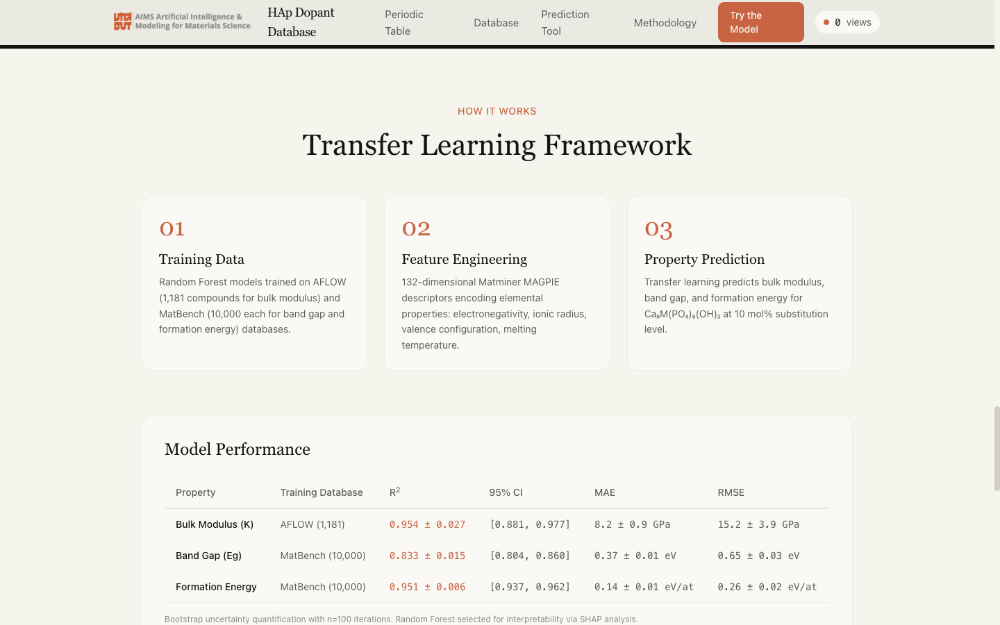

**รูปที่ 10** ขั้นตอนการพัฒนาแบบจำลอง ตั้งแต่ข้อมูลฝึก การสร้างตัวบ่งชี้ลักษณะ จนถึงการทำนายสมบัติ

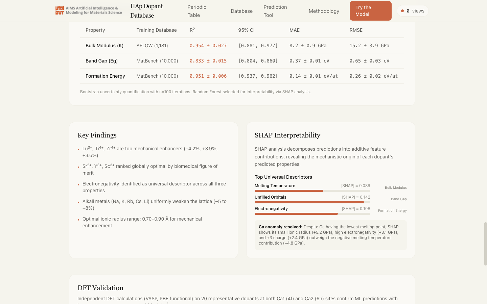

**รูปที่ 11** ตารางประสิทธิภาพของแบบจำลอง (R², MAE, RMSE พร้อมช่วงความเชื่อมั่น 95%)
ข้อค้นพบสำคัญ และการวิเคราะห์ความสำคัญของตัวแปรด้วย SHAP

### 6.6 การใช้งานบนโทรศัพท์มือถือ

ฐานข้อมูลรองรับการแสดงผลแบบ responsive ผู้ใช้สามารถเปิดผ่านโทรศัพท์มือถือได้โดยไม่ต้องติดตั้งแอปพลิเคชัน
เมนูจะย่อเป็นปุ่มสามขีด และตารางข้อมูลสามารถเลื่อนตามแนวนอนได้

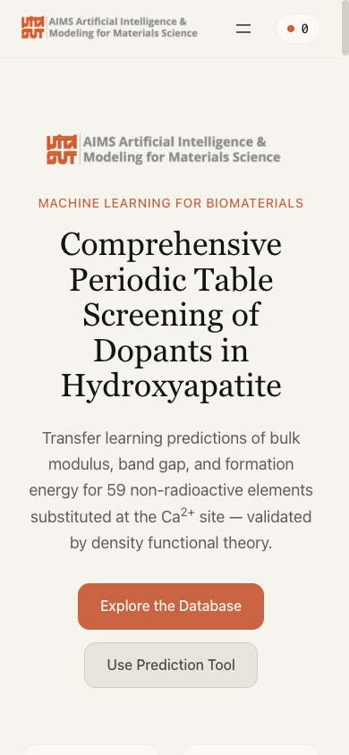{width=2.4in}

**รูปที่ 12** การแสดงผลบนหน้าจอขนาด 390 × 844 พิกเซล

## 7. ระบบติดตามจำนวนผู้เข้าชม

ฐานข้อมูลติดตั้งระบบเก็บสถิติการเข้าใช้งานด้วยบริการ GoatCounter ซึ่งเป็นระบบที่ไม่ใช้คุกกี้
และไม่เก็บข้อมูลส่วนบุคคลของผู้เข้าชม จำนวนผู้เข้าชมสะสมแสดงที่มุมขวาบนของทุกหน้า
และรายงานสถิติโดยละเอียดเปิดให้เข้าถึงแบบสาธารณะที่ https://hap-dopant-db.goatcounter.com

ข้อมูลที่ระบบจัดเก็บและใช้เป็นหลักฐานการใช้ประโยชน์ ได้แก่ จำนวนการเข้าชมรายวัน/รายสัปดาห์/รายเดือน
หน้าที่ถูกเข้าชม แหล่งอ้างอิงที่นำผู้ใช้เข้าสู่เว็บไซต์ (referrer) ประเทศของผู้เข้าชม เบราว์เซอร์
และระบบปฏิบัติการ

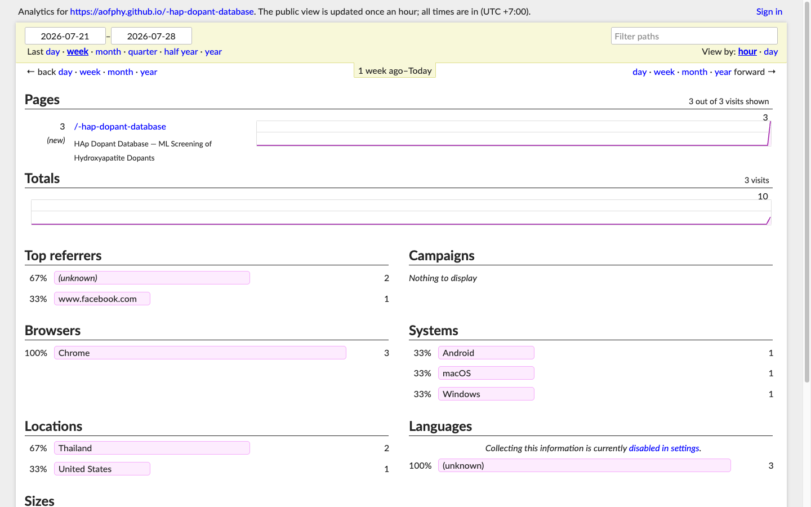

**รูปที่ 13** ตัวอย่างรายงานสถิติผู้เข้าชมแบบสาธารณะ แสดงจำนวนการเข้าชม แหล่งอ้างอิง
ประเทศของผู้เข้าชม เบราว์เซอร์ และระบบปฏิบัติการ

## 8. ระดับความสำเร็จของการพัฒนาฐานข้อมูล

| ตัวชี้วัด | ผลการดำเนินงาน |
|---|---|
| ความครบถ้วนของข้อมูล | ครบ 59 ธาตุที่ไม่มีกัมมันตภาพรังสี พร้อมสมบัติ 3 ประเภทต่อธาตุ |
| การตรวจสอบความถูกต้อง | ตรวจสอบด้วย DFT 20 สารเจือ (58 โครงสร้าง) ค่า MAE ของพารามิเตอร์แลตทิซ 0.009 Å |
| ความแม่นยำของแบบจำลอง | R² = 0.954 (bulk modulus), 0.833 (band gap), 0.951 (formation energy) |
| การเผยแพร่ | เผยแพร่ออนไลน์แบบเปิดสาธารณะ เข้าถึงได้ตลอด 24 ชั่วโมง |
| ความสามารถเชิงโต้ตอบ | ค้นหา กรอง เรียงลำดับ และทำนายสมบัติแบบโต้ตอบ 3 โหมด |
| การติดตามการใช้ประโยชน์ | ติดตั้งระบบเก็บสถิติผู้เข้าชมพร้อมรายงานสาธารณะ |
| ความโปร่งใสของข้อมูล | เปิดเผยซอร์สโค้ดและชุดข้อมูลผ่าน GitHub |

## 9. การอ้างอิง

ผู้ที่นำข้อมูลจากฐานข้อมูลนี้ไปใช้ประโยชน์ ขอความอนุเคราะห์อ้างอิงผลงานต้นทาง

> "Machine-learning screening of cationic dopants in hydroxyapatite: Transfer learning predictions
> validated by density functional theory." *Physical Review Materials* (2025).

## 10. ภาคผนวก — ข้อมูลทางเทคนิค

| รายการ | รายละเอียด |
|---|---|
| เทคโนโลยีส่วนหน้า | React 19 + TypeScript + Vite + Tailwind CSS |
| ไลบรารีสร้างกราฟ | Recharts |
| การให้บริการ (hosting) | GitHub Pages พร้อมการ deploy อัตโนมัติผ่าน GitHub Actions |
| สถาปัตยกรรม | เว็บแบบสถิต (static site) ไม่มีเซิร์ฟเวอร์ฐานข้อมูลเบื้องหลัง ข้อมูลฝังอยู่ในตัวเว็บ |
| ระบบสถิติผู้เข้าชม | GoatCounter (ไม่ใช้คุกกี้ สอดคล้องกับหลักการคุ้มครองข้อมูลส่วนบุคคล) |
| การบำรุงรักษา | ปรับปรุงข้อมูลโดยแก้ไขชุดข้อมูลในซอร์สโค้ดและ deploy ใหม่อัตโนมัติ |
